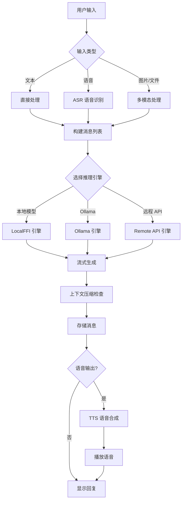
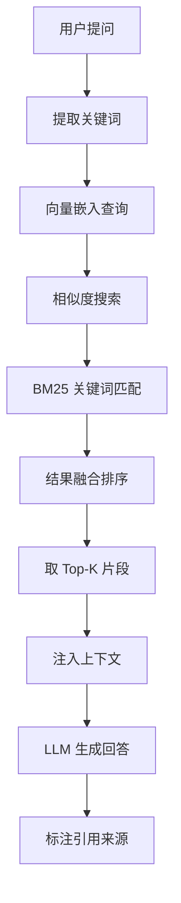
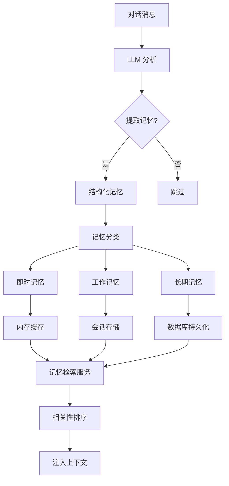
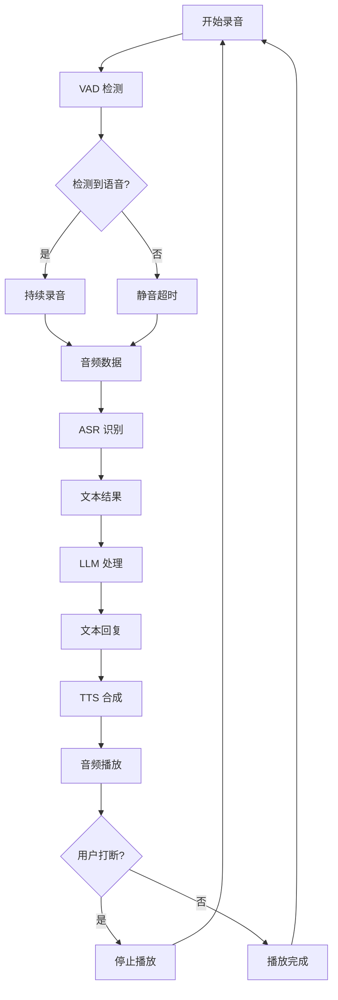

# LLM Studio 产品需求文档 (PRD)

**版本：** 1.0  
**日期：** 2026-05-13  
**状态：** 基于现有代码库分析生成  

---

## 一、产品概述

### 1.1 产品定位
LLM Studio 是一款跨平台（macOS、iOS、Android、Windows、Linux）的本地大模型推理与 AI 助手客户端，支持本地模型推理（通过 llama.cpp FFI）和远程模型 API（OpenAI、Anthropic、Ollama 协议），提供多模型管理、会话隔离、知识库检索、语音交互、记忆引擎等企业级功能。

### 1.2 目标用户
- **个人用户**：希望在本地设备运行大模型，保护数据隐私
- **开发者**：需要集成多种 AI 模型进行开发测试
- **企业用户**：需要私有化部署的 AI 助手解决方案
- **研究人员**：需要对比不同模型的性能与效果

### 1.3 核心价值
1. **隐私优先**：所有数据本地存储，支持离线使用
2. **多引擎统一**：LocalFFI + Ollama + RemoteAPI 三引擎自动切换
3. **全链路 AI**：从模型推理、知识库检索到语音交互的完整闭环
4. **跨平台一致**：一套代码支持桌面和移动端

---

## 二、功能需求

### 2.1 核心推理引擎
#### 2.1.1 本地模型推理（LocalFFI）
- **功能描述**：通过 llama.cpp FFI 绑定在本地设备运行 GGUF 格式模型
- **输入**：模型文件路径、用户消息、系统提示词、上下文历史
- **输出**：流式文本生成、token 统计、性能指标
- **技术约束**：
  - 支持 Metal（macOS/iOS）、Vulkan（Android）、CUDA（Windows/Linux）加速
  - 自动检测设备内存并动态调整上下文长度和批处理大小
  - 支持多模态模型（通过 mmproj 投影文件）

#### 2.1.2 Ollama 集成
- **功能描述**：连接本地或远程 Ollama 服务进行模型推理
- **输入**：Ollama 服务地址、模型名称、消息列表
- **输出**：流式文本生成
- **支持场景**：
  - 本地 Ollama 服务（localhost:11434）
  - 远程 Ollama 服务（自定义地址）

#### 2.1.3 远程 API 调用
- **功能描述**：调用 OpenAI、Anthropic 等云端模型 API
- **输入**：API Key、模型名称、消息列表、参数配置
- **输出**：流式文本生成、token 用量统计
- **支持协议**：
  - OpenAI Chat Completions API
  - Anthropic Messages API
  - 自定义 Ollama 协议

### 2.2 多模型管理
#### 2.2.1 模型市场
- **功能描述**：浏览、搜索、下载开源模型
- **数据源**：
  - Hugging Face 模型库
  - ModelScope 模型库
- **功能点**：
  - 模型搜索与过滤（按任务、大小、量化格式）
  - 模型详情展示（描述、参数、许可证）
  - 一键下载与进度跟踪

#### 2.2.2 模型管理
- **功能描述**：管理已下载和配置的模型
- **操作**：
  - 查看本地模型列表（路径、大小、状态）
  - 编辑模型元数据（名称、描述、标签）
  - 链接多模态投影文件（mmproj）
  - 删除模型文件

#### 2.2.3 模型加载与配置
- **功能描述**：动态加载模型并配置推理参数
- **配置项**：
  - 上下文长度（context length）
  - 批处理大小（batch size）
  - 温度（temperature）、top_p、top_k
  - GPU 层数（n_gpu_layers）
  - 量化级别（quantization）

### 2.3 会话管理
#### 2.3.1 会话隔离
- **功能描述**：每个会话独立配置模型、提示词、上下文
- **数据结构**：
  - 会话 ID、标题、创建时间
  - 关联模型 ID、系统提示词
  - 文件夹分类、置顶/归档状态

#### 2.3.2 消息管理
- **功能描述**：存储和管理对话消息
- **消息类型**：
  - 用户消息（支持文本、图片、文件）
  - 助手回复（支持文本、代码块、Markdown）
  - 系统消息（提示词、上下文注入）
- **功能点**：
  - 消息搜索（全文检索）
  - 消息编辑与重新生成
  - 消息导出（Markdown、JSON）

#### 2.3.3 上下文管理
- **功能描述**：自动管理对话上下文窗口
- **策略**：
  - 基于 token 数量的自动压缩
  - 基于消息数量的滑动窗口
  - 关键信息保留（系统提示词、最近消息）

### 2.4 知识库与 RAG
#### 2.4.1 知识库管理
- **功能描述**：创建和管理本地知识库
- **支持格式**：
  - PDF、DOCX、XLSX、PPTX、TXT、RTF、EPUB
  - 网页 URL（通过 Jina Reader API 解析）
- **操作**：
  - 创建知识库（名称、描述）
  - 上传文档（自动解析、分块、索引）
  - 管理文档（查看、删除、重新索引）

#### 2.4.2 检索增强生成（RAG）
- **功能描述**：基于知识库内容增强模型回答
- **技术实现**：
  - 文档分块（按段落、句子、固定长度）
  - 向量嵌入（通过远程 API 或本地模型）
  - 相似度搜索（余弦相似度、BM25）
- **集成方式**：
  - 自动检索相关片段注入上下文
  - 支持引用来源标注

### 2.5 记忆引擎
#### 2.5.1 记忆存储
- **功能描述**：自动提取和存储对话中的关键信息
- **记忆类型**：
  - 即时记忆（当前对话）
  - 工作记忆（短期上下文）
  - 长期记忆（持久化存储）
  - 归档记忆（压缩存储）
- **提取方式**：
  - LLM 自动提取关键事实
  - 用户手动标记重要信息

#### 2.5.2 记忆检索
- **功能描述**：在对话中自动检索相关记忆
- **检索策略**：
  - 关键词匹配
  - 语义相似度搜索
  - 时间衰减权重
- **应用场景**：
  - 个性化回答（基于用户偏好）
  - 上下文延续（基于历史对话）
  - 知识积累（基于长期记忆）

### 2.6 语音交互
#### 2.6.1 语音识别（ASR）
- **功能描述**：将用户语音转换为文本
- **支持引擎**：
  - Sherpa-ONNX（本地 Whisper 模型）
  - 系统语音识别（iOS/Android 原生）
  - OpenAI Whisper API（云端）
- **功能点**：
  - 实时语音识别
  - 语音活动检测（VAD）
  - 多语言支持

#### 2.6.2 语音合成（TTS）
- **功能描述**：将模型回复转换为语音
- **支持引擎**：
  - OpenAI TTS API
  - 系统 TTS（iOS/Android 原生）
  - MeloTTS（本地模型）
- **功能点**：
  - 多音色选择
  - 语速、音调调节
  - 流式音频播放

#### 2.6.3 语音对话
- **功能描述**：实现完整的语音交互流程
- **流程**：
  1. 用户语音输入 → ASR 转文本
  2. 文本 → LLM 生成回复
  3. 回复文本 → TTS 合成语音
  4. 语音播放（支持打断）

### 2.7 Skills 与 MCP
#### 2.7.1 Skills 插件系统
- **功能描述**：扩展 AI 助手的专业领域能力
- **内置 Skills**：
  - 30 位专家角色（品牌、设计、前端、后端等）
  - 3 个工具技能（搜索、计算、文件操作）
- **自定义 Skills**：
  - 创建自定义专家角色
  - 定义系统提示词和工具集
  - 编辑器 UI（部分实现）

#### 2.7.2 MCP 协议集成
- **功能描述**：通过 Model Context Protocol 扩展工具能力
- **支持模式**：
  - stdio 模式（本地进程通信）
  - HTTP 模式（远程服务调用）
- **功能点**：
  - MCP 服务器配置管理
  - 工具发现与调用
  - 上下文注入

### 2.8 系统功能
#### 2.8.1 数据备份与恢复
- **功能描述**：导出和导入应用数据
- **备份内容**：
  - 会话历史
  - 模型配置
  - 知识库索引
  - 用户设置
- **格式**：JSON 压缩包

#### 2.8.2 应用安全
- **功能描述**：保护用户数据和隐私
- **安全措施**：
  - 应用锁（PIN 码、生物识别）
  - API Key 加密存储（flutter_secure_storage）
  - 本地数据加密（iOS/Android 原生插件）

#### 2.8.3 分享扩展
- **功能描述**：从其他应用分享内容到 LLM Studio
- **支持内容**：
  - 文本片段
  - 网页 URL
  - 图片
  - 文件

---

## 三、业务流程

### 3.1 核心对话流程


### 3.2 知识库检索流程


### 3.3 记忆提取流程


### 3.4 语音对话流程


---

## 四、模块划分

### 4.1 架构分层
```
┌─────────────────────────────────────┐
│           表示层 (Presentation)      │
│  ┌─────────────────────────────┐   │
│  │       features/ (52 文件)    │   │
│  │  session/ model/ settings/  │   │
│  │  rag/ memory/ mcp/ av/     │   │
│  └─────────────────────────────┘   │
├─────────────────────────────────────┤
│           业务逻辑层 (Domain)        │
│  ┌─────────────────────────────┐   │
│  │        core/ (102 文件)      │   │
│  │  engines/ services/ providers│   │
│  │  storage/ router/ utils/    │   │
│  └─────────────────────────────┘   │
├─────────────────────────────────────┤
│           数据层 (Data)              │
│  ┌─────────────────────────────┐   │
│  │   Drift ORM (14 表)         │   │
│  │   SharedPreferences         │   │
│  │   flutter_secure_storage    │   │
│  └─────────────────────────────┘   │
├─────────────────────────────────────┤
│           基础设施层 (Infrastructure)│
│  ┌─────────────────────────────┐   │
│  │   llama.cpp FFI             │   │
│  │   sherpa_onnx               │   │
│  │   platform channels         │   │
│  └─────────────────────────────┘   │
└─────────────────────────────────────┘
```

### 4.2 核心模块清单

| 模块 | 文件数 | 代码行数 | 主要职责 |
|------|--------|----------|----------|
| **core/engines** | 10 | ~8,000 | 推理引擎（LocalFFI、Ollama、RemoteAPI） |
| **core/services** | 53 | ~25,000 | 业务服务（ASR、TTS、RAG、记忆等） |
| **core/providers** | 4 | ~2,000 | Riverpod 状态管理 |
| **core/storage** | 1 | ~1,500 | Drift ORM 数据库定义 |
| **core/router** | 1 | ~200 | go_router 路由配置 |
| **features/session** | 15 | ~12,000 | 会话管理 UI |
| **features/model** | 8 | ~6,000 | 模型管理 UI |
| **features/settings** | 12 | ~8,000 | 设置页面 UI |
| **features/rag** | 5 | ~3,000 | 知识库管理 UI |
| **features/memory** | 4 | ~2,500 | 记忆管理 UI |
| **features/mcp** | 3 | ~2,000 | MCP 服务管理 UI |
| **features/av** | 3 | ~2,500 | 音视频交互 UI |
| **features/skill** | 11 | ~5,000 | Skills 插件系统 |

### 4.3 关键文件说明

| 文件 | 行数 | 职责 |
|------|------|------|
| `session_detail_page.dart` | 5,096 | 会话详情页（聊天界面） |
| `model_inference_engine.dart` | 1,537 | 统一推理引擎接口 |
| `local_ffi_engine.dart` | 1,289 | llama.cpp FFI 引擎 |
| `file_parser_service.dart` | 1,416 | 多格式文件解析 |
| `download_task_manager.dart` | 1,253 | 模型下载管理 |
| `voice_dialogue_service.dart` | 1,288 | 语音对话引擎 |
| `url_parser_engine.dart` | 1,218 | URL 内容解析 |
| `database.dart` | ~1,500 | Drift ORM 数据库定义 |

---

## 五、数据交互

### 5.1 数据库表结构

#### 5.1.1 核心表
```sql
-- 会话表
CREATE TABLE Sessions (
    id TEXT PRIMARY KEY,
    title TEXT NOT NULL,
    modelId TEXT,
    systemPrompt TEXT,
    folderId TEXT,
    isPinned INTEGER DEFAULT 0,
    isArchived INTEGER DEFAULT 0,
    createdAt INTEGER NOT NULL,
    updatedAt INTEGER NOT NULL
);

-- 消息表
CREATE TABLE Messages (
    id TEXT PRIMARY KEY,
    sessionId TEXT NOT NULL,
    role TEXT NOT NULL, -- 'user', 'assistant', 'system'
    content TEXT NOT NULL,
    tokenCount INTEGER,
    createdAt INTEGER NOT NULL,
    FOREIGN KEY (sessionId) REFERENCES Sessions(id)
);

-- 模型表
CREATE TABLE Models (
    id TEXT PRIMARY KEY,
    name TEXT NOT NULL,
    path TEXT,
    type TEXT NOT NULL, -- 'local', 'remote', 'ollama'
    provider TEXT, -- 'openai', 'anthropic', 'ollama'
    apiKey TEXT,
    baseUrl TEXT,
    parameters TEXT, -- JSON 格式
    isMultimodal INTEGER DEFAULT 0,
    mmprojPath TEXT,
    createdAt INTEGER NOT NULL
);
```

#### 5.1.2 知识库表
```sql
-- 知识库表
CREATE TABLE KnowledgeBases (
    id TEXT PRIMARY KEY,
    name TEXT NOT NULL,
    description TEXT,
    embeddingModel TEXT,
    createdAt INTEGER NOT NULL
);

-- 文档表
CREATE TABLE Documents (
    id TEXT PRIMARY KEY,
    knowledgeBaseId TEXT NOT NULL,
    name TEXT NOT NULL,
    path TEXT,
    url TEXT,
    fileType TEXT,
    chunkCount INTEGER,
    createdAt INTEGER NOT NULL,
    FOREIGN KEY (knowledgeBaseId) REFERENCES KnowledgeBases(id)
);

-- 文档分块表
CREATE TABLE DocumentChunks (
    id TEXT PRIMARY KEY,
    documentId TEXT NOT NULL,
    content TEXT NOT NULL,
    embedding TEXT, -- JSON 数组
    chunkIndex INTEGER,
    createdAt INTEGER NOT NULL,
    FOREIGN KEY (documentId) REFERENCES Documents(id)
);
```

#### 5.1.3 记忆表
```sql
-- 记忆表
CREATE TABLE Memories (
    id TEXT PRIMARY KEY,
    sessionId TEXT,
    content TEXT NOT NULL,
    type TEXT NOT NULL, -- 'instant', 'working', 'longterm', 'archived'
    importance REAL,
    accessCount INTEGER DEFAULT 0,
    lastAccessedAt INTEGER,
    createdAt INTEGER NOT NULL,
    FOREIGN KEY (sessionId) REFERENCES Sessions(id)
);
```

### 5.2 数据流图

#### 5.2.1 推理请求数据流
```
用户输入 → 消息构建 → 推理引擎 → 流式响应 → 消息存储
    ↓           ↓           ↓           ↓           ↓
文本/语音   角色/内容    模型配置    token统计   数据库
```

#### 5.2.2 知识库检索数据流
```
用户提问 → 查询向量化 → 相似度搜索 → 片段检索 → 上下文注入
    ↓           ↓           ↓           ↓           ↓
文本输入   嵌入模型    向量数据库   BM25排序    提示词模板
```

### 5.3 API 接口规范

#### 5.3.1 OpenAI 兼容接口
```dart
// 请求格式
{
  "model": "gpt-4",
  "messages": [
    {"role": "system", "content": "You are a helpful assistant."},
    {"role": "user", "content": "Hello!"}
  ],
  "stream": true,
  "temperature": 0.7,
  "max_tokens": 1000
}

// 响应格式（流式）
data: {"id":"chatcmpl-123","object":"chat.completion.chunk","choices":[{"delta":{"content":"Hello"},"index":0}]}
data: [DONE]
```

#### 5.3.2 Anthropic 接口
```dart
// 请求格式
{
  "model": "claude-3-opus-20240229",
  "max_tokens": 1024,
  "messages": [
    {"role": "user", "content": "Hello!"}
  ],
  "stream": true
}

// 响应格式（流式）
event: content_block_delta
data: {"type":"content_block_delta","index":0,"delta":{"type":"text_delta","text":"Hello"}}
```

---

## 六、非功能需求

### 6.1 性能要求
- **首次响应时间**：< 2 秒（本地模型）、< 1 秒（远程 API）
- **生成速度**：> 10 tokens/秒（本地模型）、> 30 tokens/秒（远程 API）
- **内存占用**：< 2GB（4GB 设备）、< 4GB（8GB 设备）
- **启动时间**：< 3 秒（冷启动）

### 6.2 可靠性要求
- **崩溃率**：< 0.1%
- **数据丢失率**：0%（本地持久化）
- **模型加载成功率**：> 99%
- **网络请求成功率**：> 95%

### 6.3 安全性要求
- **数据加密**：AES-256 本地加密
- **传输安全**：HTTPS/TLS 1.3
- **密钥管理**：flutter_secure_storage
- **访问控制**：应用锁 + 生物识别

### 6.4 兼容性要求
- **操作系统**：
  - macOS 10.15+
  - iOS 14.0+
  - Android 8.0+ (API 26+)
  - Windows 10+
  - Linux (Ubuntu 20.04+)
- **设备架构**：
  - x86_64 (Windows/Linux/macOS)
  - arm64 (macOS/iOS/Android)
- **屏幕尺寸**：
  - 手机：320px - 428px
  - 平板：768px - 1024px
  - 桌面：1280px+

---

## 七、验收标准

### 7.1 功能验收
- [ ] 本地模型加载与推理正常
- [ ] 远程 API 调用正常（OpenAI、Anthropic）
- [ ] Ollama 集成正常
- [ ] 会话创建、编辑、删除正常
- [ ] 知识库上传、检索正常
- [ ] 语音识别与合成正常
- [ ] 数据备份与恢复正常

### 7.2 性能验收
- [ ] 本地模型推理速度 ≥ 10 tokens/秒
- [ ] 内存占用符合设备要求
- [ ] 应用启动时间 < 3 秒
- [ ] 无内存泄漏（长时间运行测试）

### 7.3 质量验收
- [ ] 静态分析零 issues
- [ ] 测试覆盖率 ≥ 60%
- [ ] 崩溃率 < 0.1%
- [ ] 无数据丢失风险

---

## 八、附录

### 8.1 术语表
- **GGUF**：GPT-Generated Unified Format，本地模型文件格式
- **FFI**：Foreign Function Interface，外部函数接口
- **RAG**：Retrieval Augmented Generation，检索增强生成
- **MCP**：Model Context Protocol，模型上下文协议
- **ASR**：Automatic Speech Recognition，自动语音识别
- **TTS**：Text-to-Speech，文本转语音
- **VAD**：Voice Activity Detection，语音活动检测
- **BM25**：Best Matching 25，信息检索算法

### 8.2 参考文档
- `LLM-Studio-技术文档.md` - 技术架构文档
- `大模型多平台客户端全量开发文档.md` - 完整需求规格
- `功能开发冲刺计划.md` - 开发计划
- `基于 Flutter 的多端 AI 助手应用实现方案.md` - 技术实现方案

---

**文档生成时间：** 2026-05-13  
**基于代码版本：** 2026-05-13 分析  
**文档状态：** 初始版本，基于现有代码库分析生成