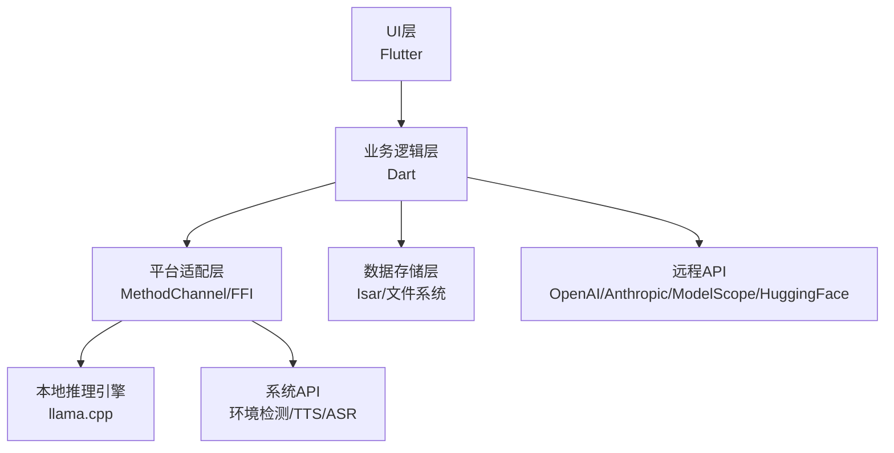

# 基于 Flutter 的多端 AI 助手应用实现方案

## 一、整体架构设计

采用分层架构设计，确保各模块解耦且可复用：


### 核心分层职责

1. **UI层**：模型下载页、会话列表页、聊天页、设置页

2. **业务逻辑层**：环境检测、模型管理、会话管理、工具集成、语音处理

3. **平台适配层**：原生能力封装（推理引擎、系统API）

4. **数据存储层**：会话/消息数据库、模型文件存储

---

## 二、系统环境检测模块

### 技术选型

- 通用信息：`dart:io` 的 `Platform` 类

- CPU/内存/显存：`MethodChannel` 调用各平台原生API

### 实现步骤

1. **创建MethodChannel**：通道名 `com.example.ai_assistant/env`

2. **各平台原生实现**：

    - macOS/iOS：`sysctlbyname`（CPU/内存）+ `Metal`（GPU内存）

    - Windows：`WMI`（CPU/内存）+ `DirectX`（显存）

    - Android：`ActivityManager`（内存）+ `Build`（CPU）

3. **Dart层调用**：获取环境信息后推荐模型量化级别（如Q4_K_M/Q8_0）

### 环境信息数据结构

```Dart

class DeviceEnv {
  final String cpuArch; // arm64/x86_64
  final int cpuCores;
  final int totalMemoryMB;
  final int? gpuMemoryMB; // macOS混合内存/Windows显存
}
```

---

## 三、模型下载模块（ModelScope & HuggingFace）

### 技术选型

- 网络请求：`Dio`

- 文件存储：`path_provider`

- 下载进度管理：`Isar`

### 核心功能实现

#### 1. ModelScope API集成

- 模型列表：`GET /api/v1/models`（参数：task=text-generation）

- 模型下载：直接获取文件URL并下载

#### 2. HuggingFace API集成

- 模型列表：`GET /api/models`（参数：pipeline_tag=text-generation）

- 模型下载：`https://huggingface.co/{repo}/resolve/main/{file}`

#### 3. 下载管理代码示例

```Dart

class ModelDownloadService {
  final Dio _dio = Dio();
  final Isar _isar;

  Future<void> downloadModel({
    required String url,
    required String modelId,
    required String filename,
  }) async {
    final dir = await getApplicationDocumentsDirectory();
    final savePath = '${dir.path}/models/$filename';
    
    // 初始化下载任务
    final task = DownloadTask()
      ..modelId = modelId
      ..url = url
      ..savePath = savePath
      ..status = DownloadStatus.downloading
      ..progress = 0;
    
    await _isar.writeTxn(() => _isar.downloadTasks.put(task));

    // 执行下载
    await _dio.download(
      url,
      savePath,
      onReceiveProgress: (received, total) {
        if (total != -1) {
          final progress = (received / total * 100).toInt();
          _updateTaskProgress(task.id, progress);
        }
      },
    );
    
    // 标记完成
    _updateTaskStatus(task.id, DownloadStatus.completed);
  }
}
```

---

## 四、模型加载与推理模块

### 技术选型

- 本地推理：`llama.cpp` + `dart:ffi`

- 远程推理：`Dio` 调用OpenAI/Anthropic API

- 多模态支持：`llava.cpp`（LLaVA模型）

### 核心功能实现

#### 1. llama.cpp集成（本地推理）

1. **编译llama.cpp为动态库**：

    - macOS：`cmake -B build -DBUILD_SHARED_LIBS=ON && cmake --build build`

    - Windows：`cmake -B build -G "Visual Studio 17 2022" -DBUILD_SHARED_LIBS=ON && cmake --build build --config Release`

2. **Dart FFI绑定**：

```Dart

import 'dart:ffi';
import 'package:ffi/ffi.dart';

// C API定义
typedef LoadModelC = Pointer<Void> Function(
  Pointer<Utf8> path,
  Int32 nCtx,
  Int32 nGpuLayers,
);
typedef LoadModelDart = Pointer<Void> Function(
  Pointer<Utf8> path,
  int nCtx,
  int nGpuLayers,
);

// 推理服务
class LocalInferenceService {
  late final DynamicLibrary _dylib;
  late final LoadModelDart _loadModel;
  Pointer<Void>? _ctx;

  Future<void> init() async {
    _dylib = DynamicLibrary.open('libllama.dylib'); // 动态库路径
    _loadModel = _dylib.lookupFunction<LoadModelC, LoadModelDart>('load_model');
  }

  Future<void> loadModel(ModelConfig config) async {
    final pathPtr = config.localPath!.toNativeUtf8();
    _ctx = _loadModel(pathPtr, config.nCtx, config.nGpuLayers);
    calloc.free(pathPtr);
  }

  Future<String> generate(String prompt) async {
    // 调用llama.cpp的generate函数（简化示例）
    final promptPtr = prompt.toNativeUtf8();
    // ... 省略具体实现 ...
    return 'Generated response';
  }
}
```

#### 2. 远程推理API封装

```Dart

class RemoteInferenceService {
  final Dio _dio = Dio();

  Future<String> chat({
    required String apiKey,
    required String baseUrl,
    required List<Message> messages,
    required ModelConfig config,
  }) async {
    final response = await _dio.post(
      '$baseUrl/chat/completions',
      options: Options(headers: {'Authorization': 'Bearer $apiKey'}),
      data: {
        'model': config.modelName,
        'messages': messages.map((m) => {'role': m.role, 'content': m.content}).toList(),
        'temperature': config.temperature,
      },
    );
    return response.data['choices'][0]['message']['content'];
  }
}
```

---

## 五、会话管理与上下文记忆

### 技术选型

- 数据库：`Isar`（高性能NoSQL）

- 状态管理：`Riverpod`

### 数据模型设计

```Dart

@collection
class Session {
  Id id = Isar.autoIncrement;
  late String name;
  late String modelId;
  late DateTime createdAt;
  final messages = IsarLinks<Message>();
}

@collection
class Message {
  Id id = Isar.autoIncrement;
  late String role; // system/user/assistant
  late String content;
  late DateTime timestamp;
  @Backlink(to: 'messages')
  final session = IsarLink<Session>();
}

@collection
class ModelConfig {
  Id id = Isar.autoIncrement;
  late String modelId; // 唯一标识
  late String modelName;
  late String modelType; // local/openai/anthropic
  String? localPath;
  String? apiKey;
  String? apiBaseUrl;
  late int nCtx;
  late int nGpuLayers;
  late double temperature;
  String? systemPrompt;
}
```

### 上下文记忆管理

```Dart

class ContextManager {
  final Isar _isar;

  Future<List<Message>> buildContext(Session session) async {
    // 加载会话消息（按时间倒序）
    final messages = await _isar.messages
        .filter()
        .session((q) => q.idEqualTo(session.id))
        .sortByTimestampDesc()
        .findAll();

    // 分离system消息和非system消息
    final systemMessages = messages.where((m) => m.role == 'system').toList();
    final nonSystemMessages = messages.where((m) => m.role != 'system').toList();

    // 构建上下文：system + 最近50条非system消息（正序）
    final context = <Message>[];
    context.addAll(systemMessages);
    context.addAll(nonSystemMessages.take(50).reversed);
    return context;
  }
}
```

---

## 六、MCP & Web Search集成

### 1. MCP（Model Context Protocol）

- 实现方式：`JSON-RPC 2.0` over stdio

- 核心代码：

```Dart

class McpClient {
  Process? _process;
  final StreamController<Map<String, dynamic>> _responseController = StreamController();

  Future<void> connect(String serverPath) async {
    _process = await Process.start(serverPath, []);
    _process!.stdout
        .transform(utf8.decoder)
        .listen((data) => _responseController.add(jsonDecode(data)));
  }

  Future<List<McpTool>> listTools() async {
    // 发送JSON-RPC请求
    _process!.stdin.writeln(jsonEncode({
      'jsonrpc': '2.0',
      'id': 1,
      'method': 'tools/list',
    }));
    // 等待响应并解析
    final response = await _responseController.stream.first;
    return (response['result']['tools'] as List)
        .map((t) => McpTool.fromJson(t))
        .toList();
  }

  Future<String> callTool(String toolName, Map<String, dynamic> args) async {
    // 调用工具实现
  }
}
```

### 2. Web Search

- 技术选型：`SerpAPI` / `Bing Search API`

- 工具定义（Function Calling格式）：

```Dart

final webSearchTool = {
  'name': 'web_search',
  'description': 'Search the web for recent information',
  'parameters': {
    'type': 'object',
    'properties': {
      'query': {'type': 'string', 'description': 'The search query'},
    },
    'required': ['query'],
  },
};
```

---

## 七、多模态支持

### 技术选型

- 文件选择：`file_picker` / `image_picker`

- PDF处理：`pdf_text`

- 图片推理：`llava.cpp`

### 核心流程

1. 用户上传图片/PDF

2. 提取内容（图片base64/文本）

3. 构建多模态prompt

4. 调用多模态模型推理

---

## 八、语音合成（TTS）与语音识别（ASR）

### 1. TTS（系统原生API）

- iOS/macOS：`AVSpeechSynthesizer`

- Android：`TextToSpeech`

- Windows：`System.Speech.Synthesis`

#### MethodChannel实现（iOS Swift）

```Swift

import AVFoundation

class TtsHandler: NSObject, FlutterPlugin {
  let synthesizer = AVSpeechSynthesizer()

  func handle(_ call: FlutterMethodCall, result: @escaping FlutterResult) {
    if call.method == "speak" {
      let text = call.arguments as! String
      let utterance = AVSpeechUtterance(string: text)
      utterance.voice = AVSpeechSynthesisVoice(language: "zh-CN")
      synthesizer.speak(utterance)
      result(nil)
    }
  }
}
```

### 2. ASR（Vosk离线识别）

- 技术选型：`vosk_flutter`

- 实现步骤：

    1. 下载Vosk中文模型（`vosk-model-small-cn-0.22`）

    2. 初始化模型和识别器

    3. 录音并识别

```Dart

import 'package:vosk_flutter/vosk_flutter.dart';

class AsrService {
  final VoskFlutter _vosk = VoskFlutter();
  Model? _model;
  Recognizer? _recognizer;

  Future<void> init() async {
    _model = await _vosk.createModel('assets/models/vosk-model-small-cn-0.22');
    _recognizer = await _vosk.createRecognizer(_model!, 16000.0);
  }

  Future<String> recognize(Uint8List audioData) async {
    await _recognizer!.acceptWaveform(audioData);
    final result = await _recognizer!.getFinalResult();
    return result['text'] as String;
  }
}
```

---

## 九、技术栈总结

|模块|技术选型|
|---|---|
|UI框架|Flutter|
|状态管理|Riverpod|
|本地数据库|Isar|
|网络请求|Dio|
|本地推理|llama.cpp + dart:ffi|
|MCP|JSON-RPC + Process|
|Web Search|SerpAPI|
|文件选择|file_picker/image_picker|
|TTS|系统原生API|
|ASR|Vosk + vosk_flutter|
---

## 十一、核心能力进阶优化方案

### 11.1 推理加速：集成 Metal（macOS/iOS）、CUDA（Windows）硬件加速

#### 核心目标

基于原有 `llama.cpp` 本地推理底座，打通各平台专属硬件加速能力，解决纯CPU推理速度慢、内存占用高的问题，实现端侧大模型的流畅推理，同时对齐原方案的设备环境检测模块，实现加速能力的自动适配与动态调度。

#### 技术原理与选型

`llama.cpp` 底层基于GGML张量计算库，原生支持**Metal（苹果生态）**、**CUDA（NVIDIA显卡）** 硬件后端，可将Transformer模型的计算层offload到GPU，大幅降低CPU占用、提升推理速度（相比纯CPU推理，加速比可达5-20倍）。

- 苹果端：Metal框架，适配macOS/iOS的统一内存架构，无需单独显存，直接利用系统共享内存

- Windows端：CUDA框架，适配NVIDIA显卡，利用专用显存做张量计算，支持多GPU调度

- 兼容兜底：纯CPU推理作为兜底，硬件加速不可用时自动降级

---

#### 11.1.1 Metal（macOS/iOS）端加速实现

##### 步骤1：开启Metal后端的llama.cpp动态库编译

基于原方案的llama.cpp编译流程，新增Metal编译参数，生成带Metal加速能力的动态库：

```Bash
# macOS 动态库编译（开启Metal）
cmake -B build_metal \
  -DBUILD_SHARED_LIBS=ON \
  -DGGML_METAL=ON \
  -DCMAKE_OSX_ARCHITECTURES="arm64;x86_64" \
  -DCMAKE_BUILD_TYPE=Release
cmake --build build_metal --config Release

# iOS 静态库编译（开启Metal，适配真机/模拟器）
cmake -B build_ios \
  -DCMAKE_SYSTEM_NAME=iOS \
  -DCMAKE_OSX_ARCHITECTURES="arm64;x86_64" \
  -DCMAKE_OSX_DEPLOYMENT_TARGET=14.0 \
  -DBUILD_SHARED_LIBS=OFF \
  -DGGML_METAL=ON \
  -DCMAKE_BUILD_TYPE=Release
cmake --build build_ios --config Release
```

##### 步骤2：Flutter原生工程适配

1. **macOS端**：

   - 将编译好的 `libllama.dylib` 放入macOS工程的 `Frameworks` 目录，在 `Build Settings` 中配置 `Runtime Search Paths` 为 `@executable_path/../Frameworks`

   - 在 `Runner.xcodeproj` 中链接系统框架 `Metal.framework`、`MetalKit.framework`，开启Sandbox的网络权限（Metal shader编译需要临时网络权限）

2. **iOS端**：

   - 将静态库 `libllama.a` 放入iOS工程的 `Libraries` 目录，链接 `Metal.framework`、`MetalKit.framework`

   - 在 `Info.plist` 中开启 `NSMicrophoneUsageDescription`（如需语音联动），配置最小系统版本为iOS 14.0+

##### 步骤3：Dart层推理服务适配（扩展原LocalInferenceService）

对齐原方案的FFI绑定逻辑，新增Metal加速相关的参数配置与能力检测，实现加速层的自动调度：

```Dart
// 扩展原模型配置类，新增Metal专属参数
class ModelConfig {
  // 原有参数保留
  late int nCtx;
  late int nGpuLayers; // Metal核心参数：offload到GPU的层数
  late bool enableMetal; // 是否启用Metal加速
  late int metalBatchSize; // Metal推理批处理大小
  // ... 其余原有参数
}

// 扩展原本地推理服务，新增Metal初始化与调度逻辑
class LocalInferenceService {
  late final DynamicLibrary _dylib;
  late final LoadModelDart _loadModel;
  late final IsMetalAvailableDart _isMetalAvailable; // 新增Metal可用性检测
  Pointer<Void>? _ctx;
  bool _isMetalEnabled = false;

  // 初始化FFI绑定，新增Metal相关函数映射
  Future<void> init() async {
    _dylib = DynamicLibrary.open(Platform.isMacOS || Platform.isIOS
        ? 'libllama.dylib'
        : Platform.isWindows
            ? 'llama.dll'
            : 'libllama.so');
    
    // 原有函数绑定保留
    _loadModel = _dylib.lookupFunction<LoadModelC, LoadModelDart>('load_model');
    // 新增Metal可用性检测函数绑定（llama.cpp原生提供ggml_metal_supports()）
    _isMetalAvailable = _dylib.lookupFunction<IsMetalAvailableC, IsMetalAvailableDart>('ggml_metal_supports');
    
    // 初始化时自动检测Metal能力
    _isMetalEnabled = _isMetalAvailable() == 1;
  }

  // 扩展模型加载方法，自动适配Metal参数
  Future<void> loadModel(ModelConfig config) async {
    // 对齐环境检测结果，自动设置GPU offload层数
    int finalGpuLayers = config.nGpuLayers;
    if (_isMetalEnabled && config.enableMetal) {
      // 苹果统一内存架构：全量offload到GPU，无显存溢出风险
      finalGpuLayers = 99; // llama.cpp约定99为全量offload
    }

    final pathPtr = config.localPath!.toNativeUtf8();
    _ctx = _loadModel(
      pathPtr,
      config.nCtx,
      finalGpuLayers,
    );
    calloc.free(pathPtr);

    // 校验Metal是否成功加载
    if (_isMetalEnabled) {
      debugPrint('Metal加速已启用，模型${config.modelName}已offload $finalGpuLayers层到GPU');
    }
  }
}

// 配套C函数定义
typedef IsMetalAvailableC = Int32 Function();
typedef IsMetalAvailableDart = int Function();
```

##### 关键优化点

- 利用macOS/iOS的统一内存架构，无需拆分CPU/GPU内存，自动全量offload模型层到GPU，最大化推理速度

- 自动处理Metal shader的异步编译，避免首次推理卡顿

- 适配iPhone/iPad的移动端性能限制，自动降低batch size，保证移动端流畅运行

---

#### 11.1.2 CUDA（Windows）端加速实现

##### 步骤1：开启CUDA后端的llama.dll编译

前置依赖：安装NVIDIA CUDA Toolkit 11.8+，配置CUDA环境变量，编译命令如下：

```Bash
# Windows CUDA 动态库编译（Visual Studio 2022）
cmake -B build_cuda ^
  -G "Visual Studio 17 2022" ^
  -A x64 ^
  -DBUILD_SHARED_LIBS=ON ^
  -DGGML_CUDA=ON ^
  -DGGML_CUDA_FORCE_MMQ=ON ^
  -DCMAKE_BUILD_TYPE=Release
cmake --build build_cuda --config Release
```

编译完成后，生成 `llama.dll` 及配套的CUDA依赖dll，全部放入Windows工程的 `bin` 目录。

##### 步骤2：Flutter Windows工程适配

- 在Windows的 `CMakeLists.txt` 中添加llama.dll的安装配置，确保打包时自动复制到程序运行目录

- 新增CUDA环境检测逻辑，若用户未安装CUDA运行时，自动关闭CUDA加速，降级为CPU推理

- 对齐原方案的环境检测模块，新增Windows端显存检测（通过WMI读取NVIDIA显卡显存信息）

##### 步骤3：Dart层CUDA适配与动态调度

扩展原环境检测与推理服务，实现CUDA能力自动检测、显存匹配、层数自动计算：

```Dart
// 扩展原设备环境类，新增CUDA相关参数
class DeviceEnv {
  // 原有参数保留
  final int? gpuMemoryMB; // Windows端NVIDIA显卡专用显存
  final bool isCudaAvailable; // CUDA运行时是否可用
  final int cudaDeviceCount; // 可用GPU数量
}

// 扩展Windows端环境检测MethodChannel，新增CUDA与显存检测
// Windows端原生C#实现示例
public class EnvHandler : FlutterPlugin {
  public void OnMethodCall(MethodCall call, IResult result) {
    if (call.Method == "getCudaInfo") {
      var cudaInfo = GetCudaInfoViaWMI(); // 通过WMI读取显卡显存、驱动版本
      result.Success(cudaInfo);
    }
    // 其余原有检测逻辑保留
  }
}

// 扩展本地推理服务，新增CUDA自动适配逻辑
class LocalInferenceService {
  // 原有方法与绑定保留，新增CUDA适配逻辑
  Future<int> calculateOptimalGpuLayers(ModelConfig config, DeviceEnv env) async {
    if (!env.isCudaAvailable || env.gpuMemoryMB == null) return 0;

    // 按模型参数量+量化级别，计算每层所需显存
    // 计算公式：单层显存 ≈ (模型参数量GB / 总层数) * 1024 / 量化系数
    const Map<String, double> quantCoefficient = {
      "Q2_K": 0.25,
      "Q3_K_L": 0.3,
      "Q4_K_M": 0.4,
      "Q5_K_M": 0.5,
      "Q8_0": 0.8,
      "FP16": 1.0,
    };

    // 示例：7B模型总层数35层，13B模型40层，根据模型ID自动匹配
    int totalLayers = getModelTotalLayers(config.modelId);
    double modelTotalGB = getModelParamsGB(config.modelId);
    double coef = quantCoefficient[config.quantLevel] ?? 0.4;
    double layerMemMB = (modelTotalGB / totalLayers) * 1024 * coef;

    // 预留20%显存作为缓冲，避免显存溢出
    int availableMemMB = (env.gpuMemoryMB! * 0.8).toInt();
    int maxLayers = (availableMemMB / layerMemMB).floor();

    // 不超过模型总层数
    return maxLayers.clamp(0, totalLayers);
  }
}
```

##### 关键优化点

- 支持多GPU调度，可指定模型层分散到多个GPU，适配多显卡主机

- 显存溢出自动降级：若加载时检测到显存不足，自动减少offload层数，保证模型正常加载

- 兼容无NVIDIA显卡的Windows设备，自动关闭CUDA加速，使用纯CPU推理兜底

---

### 11.2 模型优化：根据设备自动选择最佳量化级别

#### 核心目标

对齐原方案的**环境检测模块**与**模型下载模块**，建立量化级别与设备硬件的匹配规则，实现「模型下载页自动推荐最佳量化级别、禁用设备无法运行的级别、给用户提供可选项」，解决用户不懂量化、选错模型导致无法运行/卡顿的问题。

#### 核心前提：GGUF量化级别分级标准

基于主流开源大模型的GGUF量化规范，建立量化级别优先级与适配矩阵，核心维度为**内存占用、推理精度、推理速度**：

| 量化级别 | 内存占用比（相对FP16） | 精度表现 | 推理速度 | 适配场景                            |
| -------- | ---------------------- | -------- | -------- | ----------------------------------- |
| Q2_K     | 25%                    | 一般     | 最快     | 极低配设备，大模型（70B）轻量化运行 |
| Q3_K_L   | 30%                    | 良好     | 快       | 移动端/低配PC，13B+模型             |
| Q4_K_M   | 40%                    | 优秀     | 均衡     | 全平台主力推荐，精度与速度最佳平衡  |
| Q5_K_M   | 50%                    | 接近原生 | 较快     | 中高配设备，对精度有高要求的场景    |
| Q8_0     | 80%                    | 几乎无损 | 中等     | 高配PC/服务器，显存充足场景         |
| FP16     | 100%                   | 无损     | 最慢     | 专业级设备，科研/高精度推理场景     |

---

#### 实现步骤与核心逻辑

##### 步骤1：建立模型硬件需求基准库

先为主流开源模型建立参数量、层数、上下文窗口对应的内存需求基准，示例如下：

```Dart
// 模型硬件需求基准配置
class ModelHardwareRequirement {
  final String modelId;
  final double paramsGB; // 模型FP16原生参数量大小（GB）
  final int totalLayers; // 模型总层数
  final int minCtx; // 最小上下文窗口
  final int recommendCtx; // 推荐上下文窗口
  // 不同量化级别对应的最小运行内存（含上下文占用）
  final Map<String, int> minMemoryMB;
}

// 内置主流模型基准库
final Map<String, ModelHardwareRequirement> modelBaseLibrary = {
  "Qwen2.5-7B-Instruct": ModelHardwareRequirement(
    modelId: "Qwen2.5-7B-Instruct",
    paramsGB: 14.0,
    totalLayers: 35,
    minCtx: 2048,
    recommendCtx: 4096,
    minMemoryMB: {
      "Q2_K": 2048,
      "Q3_K_L": 3072,
      "Q4_K_M": 4096,
      "Q5_K_M": 5120,
      "Q8_0": 8192,
      "FP16": 16384,
    },
  ),
  "Llama3.1-8B-Instruct": ModelHardwareRequirement(
    modelId: "Llama3.1-8B-Instruct",
    paramsGB: 16.0,
    totalLayers: 32,
    minCtx: 2048,
    recommendCtx: 8192,
    minMemoryMB: {
      "Q2_K": 2560,
      "Q3_K_L": 3584,
      "Q4_K_M": 4608,
      "Q5_K_M": 5888,
      "Q8_0": 9216,
      "FP16": 18432,
    },
  ),
  // 可扩展13B/70B等大模型配置
};
```

##### 步骤2：自动匹配算法实现

基于设备环境检测结果，结合模型基准库，实现最佳量化级别自动推荐，核心逻辑如下：

```Dart
class QuantLevelMatcher {
  final DeviceEnv deviceEnv;

  QuantLevelMatcher(this.deviceEnv);

  // 核心匹配方法：返回推荐量化级别、可用级别列表、禁用级别列表
  QuantMatchResult matchModel(ModelHardwareRequirement model) {
    // 1. 获取设备可用内存（预留30%系统内存，避免OOM）
    int availableMemoryMB = (deviceEnv.totalMemoryMB * 0.7).toInt();
    // 苹果端开启Metal/Windows端开启CUDA时，可用内存叠加显存/统一内存
    if (deviceEnv.isMetalAvailable || deviceEnv.isCudaAvailable) {
      availableMemoryMB += deviceEnv.gpuMemoryMB ?? 0;
    }

    // 2. 过滤可用量化级别：满足最小内存要求
    Map<String, int> validLevels = {};
    Map<String, int> invalidLevels = {};
    model.minMemoryMB.forEach((level, minMem) {
      if (minMem <= availableMemoryMB) {
        validLevels[level] = minMem;
      } else {
        invalidLevels[level] = minMem;
      }
    });

    // 3. 推荐最佳级别：优先级 Q4_K_M > Q5_K_M > Q3_K_L > 其余
    const List<String> recommendPriority = [
      "Q4_K_M",
      "Q5_K_M",
      "Q3_K_L",
      "Q8_0",
      "Q2_K",
      "FP16"
    ];
    String? recommendLevel;
    for (String level in recommendPriority) {
      if (validLevels.containsKey(level)) {
        recommendLevel = level;
        break;
      }
    }

    // 4. 移动端特殊适配：保守推荐，优先低功耗级别
    if (Platform.isAndroid || Platform.isIOS) {
      if (validLevels.containsKey("Q3_K_L") && availableMemoryMB < 8192) {
        recommendLevel = "Q3_K_L";
      }
    }

    return QuantMatchResult(
      recommendLevel: recommendLevel ?? validLevels.keys.first,
      validLevels: validLevels,
      invalidLevels: invalidLevels,
    );
  }
}

// 匹配结果数据结构
class QuantMatchResult {
  final String recommendLevel;
  final Map<String, int> validLevels;
  final Map<String, int> invalidLevels;
}
```

##### 步骤3：与模型下载页UI联动

1. 用户进入模型下载页，选择魔搭社区/HuggingFace的目标模型后，自动触发匹配算法

2. UI层自动勾选推荐的量化级别，对禁用级别置灰并标注「设备内存不足，无法运行」

3. 给用户提供手动切换选项，同时标注每个级别的「内存占用、精度、速度」标签

4. 下载前二次校验：若用户选择了禁用级别，弹出提示，确认后再允许下载

##### 关键优化点

- 上下文窗口联动：用户调整nCtx大小时，自动重新计算内存需求，更新可用量化级别（nCtx越大，内存需求越高）

- 增量适配：从魔搭/HuggingFace拉取模型列表时，自动解析模型的参数量、量化级别，动态生成硬件需求，无需手动维护基准库

- 运行时校验：模型加载时，二次校验设备内存，若不足则自动提示降级量化级别，避免崩溃

---

### 11.3 MCP 生态：集成更多 MCP 服务器（git/slack 等）

#### 核心目标

扩展原方案的MCP客户端模块，实现MCP服务器的全生命周期管理、内置主流MCP服务器预设、会话级独立工具配置，让每个会话可独立启用git、github、slack、文件系统、数据库等不同的MCP工具，对齐原方案的「会话独立隔离」设计。

#### 技术原理

MCP（Model Context Protocol）基于JSON-RPC 2.0协议，通过stdio/HTTP与MCP服务器通信，服务器提供标准化的工具定义与调用能力，客户端无需为每个工具单独开发适配，只需对接MCP标准，即可接入生态内所有工具。

---

#### 实现步骤与核心方案

##### 步骤1：MCP服务器全生命周期管理模块

基于原方案的McpClient，扩展服务器管理类，实现服务器的安装、配置、启动、停止、健康检查、自动重启全流程管理：

```Dart
// MCP服务器配置模型
@collection
class McpServerConfig {
  Id id = Isar.autoIncrement;
  late String serverId; // 唯一标识
  late String name; // 服务器名称（如Git、GitHub、Slack）
  late String type; // 类型：stdio/http
  late String command; // 启动命令（stdio模式）
  late List<String> args; // 启动参数
  late Map<String, String> env; // 环境变量（如API_KEY）
  late bool isEnabled; // 是否启用
  late bool isAutoStart; // 是否自动启动
  DateTime? lastConnectedTime;
  String? lastError;
}

// MCP服务器管理器核心类
class McpServerManager {
  final Isar _isar;
  final Map<String, McpClient> _connectedClients = {};
  final Map<String, Process> _runningProcesses = {};

  // 1. 初始化：加载内置预设服务器
  Future<void> init() async {
    await _initBuiltinServers();
    await _autoStartEnabledServers();
  }

  // 2. 内置主流MCP服务器预设
  Future<void> _initBuiltinServers() async {
    final builtinServers = [
      // Git 服务器
      McpServerConfig()
        ..serverId = "git"
        ..name = "Git 代码管理"
        ..type = "stdio"
        ..command = "npx"
        ..args = ["-y", "@modelcontextprotocol/server-git"]
        ..env = {}
        ..isEnabled = false
        ..isAutoStart = false,
      // GitHub 服务器
      McpServerConfig()
        ..serverId = "github"
        ..name = "GitHub"
        ..type = "stdio"
        ..command = "npx"
        ..args = ["-y", "@modelcontextprotocol/server-github"]
        ..env = {"GITHUB_PERSONAL_ACCESS_TOKEN": ""}
        ..isEnabled = false
        ..isAutoStart = false,
      // Slack 服务器
      McpServerConfig()
        ..serverId = "slack"
        ..name = "Slack"
        ..type = "stdio"
        ..command = "npx"
        ..args = ["-y", "@modelcontextprotocol/server-slack"]
        ..env = {"SLACK_TOKEN": ""}
        ..isEnabled = false
        ..isAutoStart = false,
      // 文件系统服务器
      McpServerConfig()
        ..serverId = "filesystem"
        ..name = "本地文件系统"
        ..type = "stdio"
        ..command = "npx"
        ..args = ["-y", "@modelcontextprotocol/server-filesystem", "{working_dir}"]
        ..env = {}
        ..isEnabled = true
        ..isAutoStart = true,
      // 可扩展：PostgreSQL、MySQL、飞书、Notion、Google Drive等
    ];

    // 写入数据库，避免重复初始化
    await _isar.writeTxn(() async {
      for (var server in builtinServers) {
        final exists = await _isar.mcpServerConfigs
            .filter()
            .serverIdEqualTo(server.serverId)
            .isNotEmpty();
        if (!exists) {
          await _isar.mcpServerConfigs.put(server);
        }
      }
    });
  }

  // 3. 启动指定MCP服务器
  Future<McpClient?> startServer(String serverId) async {
    final config = await _isar.mcpServerConfigs
        .filter()
        .serverIdEqualTo(serverId)
        .findFirst();
    if (config == null) return null;

    // 停止已运行的进程
    await stopServer(serverId);

    try {
      // 启动子进程
      final process = await Process.start(
        config.command,
        config.args,
        environment: config.env,
      );
      _runningProcesses[serverId] = process;

      // 初始化MCP客户端并连接
      final client = McpClient();
      await client.connectProcess(process);
      _connectedClients[serverId] = client;

      // 更新状态
      await _isar.writeTxn(() async {
        config.lastConnectedTime = DateTime.now();
        config.lastError = null;
        await _isar.mcpServerConfigs.put(config);
      });

      debugPrint("MCP服务器 ${config.name} 启动成功");
      return client;
    } catch (e) {
      // 记录错误
      await _isar.writeTxn(() async {
        config.lastError = e.toString();
        await _isar.mcpServerConfigs.put(config);
      });
      debugPrint("MCP服务器启动失败: $e");
      return null;
    }
  }

  // 4. 停止服务器
  Future<void> stopServer(String serverId) async {
    _connectedClients[serverId]?.dispose();
    _connectedClients.remove(serverId);
    _runningProcesses[serverId]?.kill();
    _runningProcesses.remove(serverId);
  }

  // 5. 获取指定服务器的工具列表
  Future<List<McpTool>> getServerTools(String serverId) async {
    final client = _connectedClients[serverId];
    if (client == null) {
      final newClient = await startServer(serverId);
      if (newClient == null) return [];
      return await newClient.listTools();
    }
    return await client.listTools();
  }

  // 6. 会话级工具聚合：获取当前会话启用的所有工具
  Future<List<McpTool>> getSessionTools(Session session) async {
    final enabledServerIds = session.enabledMcpServerIds;
    final List<McpTool> allTools = [];
    for (String serverId in enabledServerIds) {
      final tools = await getServerTools(serverId);
      allTools.addAll(tools);
    }
    return allTools;
  }
}
```

##### 步骤2：与会话管理模块联动，实现会话级工具隔离

对齐原方案的会话独立设计，实现每个会话可独立配置启用的MCP服务器，互不干扰：

1. 扩展原Session数据模型，新增启用的MCP服务器ID列表：

```Dart
@collection
class Session {
  // 原有参数保留
  Id id = Isar.autoIncrement;
  late String modelId;
  late String name;
  // 新增：当前会话启用的MCP服务器ID列表
  List<String> enabledMcpServerIds = [];
  // 新增：是否启用Web Search工具
  bool enableWebSearch = false;
  final messages = IsarLinks<Message>();
}
```

1. 聊天页逻辑优化：

   - 进入会话时，自动加载该会话启用的MCP服务器，拉取工具列表

   - 将MCP工具自动转换为模型支持的Function Calling格式，传入推理请求

   - 模型返回工具调用指令时，自动调用对应MCP服务器的工具，将结果返回给模型，完成多轮工具调用

   - 工具调用记录与聊天消息绑定，存入数据库，上下文记忆中保留工具调用历史

##### 步骤3：用户自定义MCP服务器支持

提供UI界面，让用户可手动添加自定义MCP服务器，支持：

- 配置stdio模式的启动命令、参数、环境变量

- 配置HTTP模式的服务地址、认证信息

- 测试服务器连通性，预览工具列表

- 导入/导出MCP服务器配置，方便批量管理

##### 关键优化点与安全机制

- 权限隔离：文件系统MCP服务器限制访问目录，避免用户隐私泄露，默认仅允许访问应用沙盒目录，用户手动授权后才可访问其他目录

- 调用确认：敏感操作（如git提交、slack发消息、文件修改），工具调用前弹出用户确认弹窗，确认后再执行

- 超时与重试：工具调用设置超时时间（默认30s），超时自动重试，失败后给模型返回明确的错误信息

- 健康检查：后台定时检查MCP服务器进程状态，异常退出时自动重启，保证工具可用性

- 生态兼容：完全对齐MCP官方标准，支持所有符合MCP规范的第三方服务器，无需额外适配

---

### 11.4 语音优化：集成 FunASR 提升识别准确率

#### 核心目标

替换原方案的Vosk离线ASR方案，集成阿里达摩院开源的**FunASR**端侧离线语音识别框架，大幅提升中文识别准确率，同时支持长语音实时转写、标点恢复、语气词过滤、热词定制、方言识别等能力，保持「小而精、纯本地离线」的核心要求，适配Flutter全平台。

#### 技术选型与优势

FunASR是当前端侧离线中文ASR的最优方案之一，相比Vosk，核心优势：

- 中文识别准确率提升30%以上，尤其针对口语、长句、专业词汇

- 原生支持标点恢复、口语顺滑（去除「嗯/啊/这个」等语气词）、长语音断句

- 支持热词定制，可添加人名、专业术语，提升特定场景识别准确率

- 提供轻量级端侧模型（200MB左右），兼顾包体大小与识别精度

- 支持多语言、方言识别（粤语、四川话等）

- 提供C++ runtime，可通过dart:ffi无缝集成到Flutter，适配全平台

---

#### 实现步骤与核心方案

##### 步骤1：FunASR端侧runtime全平台编译

FunASR基于ONNX Runtime推理，编译各平台的动态库，适配Flutter全平台：

1. **前置依赖**：下载FunASR端侧SDK，编译ONNX Runtime静态库，配置交叉编译环境

2. **各平台编译命令核心参数**：

```Bash
# macOS 动态库编译（arm64/x86_64通用）
cmake -B build_macos \
  -DBUILD_SHARED_LIBS=ON \
  -DONNXRUNTIME_DIR=./onnxruntime \
  -DCMAKE_OSX_ARCHITECTURES="arm64;x86_64" \
  -DCMAKE_BUILD_TYPE=Release
cmake --build build_macos --config Release

# Windows 动态库编译（x64）
cmake -B build_windows ^
  -G "Visual Studio 17 2022" ^
  -A x64 ^
  -DBUILD_SHARED_LIBS=ON ^
  -DONNXRUNTIME_DIR=./onnxruntime ^
  -DCMAKE_BUILD_TYPE=Release
cmake --build build_windows --config Release

# iOS/Android 交叉编译，对应生成静态库/so库
```

编译完成后，将各平台的动态库放入Flutter工程对应的原生目录，对齐原方案的动态库集成规范。

##### 步骤2：Dart FFI绑定与ASR服务实现

基于FunASR的C API，实现Dart层的FFI绑定，封装成可复用的ASR服务，对齐原方案的接口规范，可无缝替换原有Vosk实现：

```Dart
// FunASR FFI 函数绑定
// C API 定义
typedef FunAsrInitC = Pointer<Void> Function(
  Pointer<Utf8> modelPath,
  Pointer<Utf8> quantModelPath,
  Pointer<Utf8> vocabPath,
  Int32 sampleRate,
  Int32 enablePunctuation,
  Int32 enableItn,
);
typedef FunAsrInitDart = Pointer<Void> Function(
  Pointer<Utf8> modelPath,
  Pointer<Utf8> quantModelPath,
  Pointer<Utf8> vocabPath,
  int sampleRate,
  int enablePunctuation,
  int enableItn,
);

typedef FunAsrRecognizeC = Pointer<Utf8> Function(
  Pointer<Void> ctx,
  Pointer<Int16> audioData,
  Int32 dataLength,
  Int32 isFinal,
);
typedef FunAsrRecognizeDart = Pointer<Utf8> Function(
  Pointer<Void> ctx,
  Pointer<Int16> audioData,
  int dataLength,
  int isFinal,
);

typedef FunAsrDestroyC = Void Function(Pointer<Void> ctx);
typedef FunAsrDestroyDart = void Function(Pointer<Void> ctx);

// FunASR 核心服务类
class FunAsrService {
  late final DynamicLibrary _dylib;
  late final FunAsrInitDart _initModel;
  late final FunAsrRecognizeDart _recognize;
  late final FunAsrDestroyDart _destroy;
  Pointer<Void>? _ctx;
  final ModelDownloadService _downloadService;

  FunAsrService(this._downloadService);

  // 1. 初始化：动态库绑定 + 模型自动下载
  Future<void> init() async {
    // 加载动态库
    _dylib = DynamicLibrary.open(Platform.isMacOS
        ? 'libfunasr.dylib'
        : Platform.isWindows
            ? 'funasr.dll'
            : Platform.isAndroid
                ? 'libfunasr.so'
                : 'libfunasr.a');
    
    // FFI函数绑定
    _initModel = _dylib.lookupFunction<FunAsrInitC, FunAsrInitDart>('funasr_init');
    _recognize = _dylib.lookupFunction<FunAsrRecognizeC, FunAsrRecognizeDart>('funasr_recognize');
    _destroy = _dylib.lookupFunction<FunAsrDestroyC, FunAsrDestroyDart>('funasr_destroy');

    // 自动下载离线模型（复用原方案的下载服务）
    await _downloadModelIfNeed();
    // 初始化模型
    await _loadModel();
  }

  // 2. 模型自动下载（轻量级中文模型，约200MB）
  Future<void> _downloadModelIfNeed() async {
    final modelDir = await getApplicationDocumentsDirectory();
    final modelPath = '${modelDir.path}/asr_models/speech_paraformer-large_asr_nat-zh-cn-16k-common-vocab8404-onnx';
    
    // 模型不存在时，从魔搭社区自动下载
    if (!File(modelPath).existsSync()) {
      await _downloadService.downloadModel(
        url: "https://modelscope.cn/api/v1/models/iic/speech_paraformer-large_asr_nat-zh-cn-16k-common-vocab8404-onnx/repo/files",
        modelId: "funasr_zh_cn",
        filename: "asr_models",
      );
    }
  }

  // 3. 加载ASR模型
  Future<void> _loadModel() async {
    final modelDir = await getApplicationDocumentsDirectory();
    final modelPath = '${modelDir.path}/asr_models/model.onnx'.toNativeUtf8();
    final quantModelPath = '${modelDir.path}/asr_models/model_quant.onnx'.toNativeUtf8();
    final vocabPath = '${modelDir.path}/asr_models/vocab.txt'.toNativeUtf8();

    // 初始化模型，开启标点恢复、口语顺滑
    _ctx = _initModel(
      modelPath,
      quantModelPath,
      vocabPath,
      16000, // 采样率16k，FunASR标准
      1, // 启用标点恢复
      1, // 启用ITN文本逆规范化
    );

    // 释放指针
    calloc.free(modelPath);
    calloc.free(quantModelPath);
    calloc.free(vocabPath);

    if (_ctx == nullptr) {
      throw Exception("FunASR模型初始化失败");
    }
    debugPrint("FunASR 初始化完成，离线识别已就绪");
  }

  // 4. 实时语音识别（流式）
  Future<String> recognizeStream(Uint8List audioData, {bool isFinal = false}) async {
    if (_ctx == nullptr) return "";

    // 音频格式转换：转为16k 16bit单声道PCM（FunASR要求）
    final pcmData = _convertAudioToPcm16k(audioData);
    final pcmPtr = pcmData.allocatePointer();

    // 调用识别接口
    final resultPtr = _recognize(_ctx!, pcmPtr, pcmData.length, isFinal ? 1 : 0);
    final result = resultPtr.toDartString();

    // 释放指针
    calloc.free(pcmPtr);
    return result;
  }

  // 5. 完整音频文件识别
  Future<String> recognizeFile(String filePath) async {
    final audioData = await File(filePath).readAsBytes();
    return await recognizeStream(audioData, isFinal: true);
  }

  // 6. 热词定制：添加自定义热词，提升识别准确率
  Future<void> setHotWords(List<String> hotWords) async {
    // 调用FunASR的热词设置接口，适配专业术语、人名等场景
    final hotWordsStr = hotWords.join(" ").toNativeUtf8();
    _dylib.lookupFunction<FunAsrSetHotWordsC, FunAsrSetHotWordsDart>('funasr_set_hotwords')(
      _ctx!,
      hotWordsStr,
    );
    calloc.free(hotWordsStr);
  }

  // 7. 资源释放
  void dispose() {
    if (_ctx != nullptr) {
      _destroy(_ctx!);
      _ctx = nullptr;
    }
  }

  // 音频格式转换辅助方法
  Int16List _convertAudioToPcm16k(Uint8List audioData) {
    // 实现录音音频到16k 16bit单声道PCM的转换，适配各平台录音格式
    return Int16List.fromList(audioData.buffer.asInt16List());
  }
}
```

##### 步骤3：录音模块适配与全流程闭环

基于Flutter的 `record` 插件实现录音功能，与FunASR服务联动，实现「实时录音-流式识别-文本输出」的全流程，适配全平台的录音权限与格式：

1. 权限申请：各平台录音权限申请，适配iOS的NSMicrophoneUsageDescription、Android的RECORD_AUDIO权限、macOS/Windows的麦克风权限

2. 实时流式识别：录音过程中，每200ms回调一次音频数据，传入FunASR进行流式识别，实时更新识别文本

3. 识别结束：用户停止录音时，传入isFinal=true，获取最终的识别结果，自动填入聊天输入框

4. 标点与顺滑处理：自动去除语气词，添加标点符号，输出通顺的文本

##### 步骤4：与原有TTS模块联动，实现语音对话闭环

对齐原方案的系统原生TTS模块，实现完整的语音对话流程：

1. 用户按住语音按钮说话，FunASR实时转写为文本

2. 松开按钮后，自动发送识别后的文本，调用大模型推理

3. 模型返回回复后，自动调用系统TTS进行语音播报

4. 支持「语音连续对话」模式，播报结束后自动开启录音，无需手动点击

##### 关键优化点

- 包体优化：提供轻量级模型（80MB）与高精度模型（200MB）可选，用户可按需下载，避免安装包过大

- 离线纯本地：所有识别过程完全在本地完成，无需联网，保护用户隐私

- 多语言/方言支持：可下载粤语、四川话、英语等模型，自动切换识别语言

- 热词定制：针对用户的常用词汇、专业术语，提供热词管理界面，用户可手动添加，提升识别准确率

- 性能优化：端侧推理占用CPU极低，移动端实时识别无卡顿，不影响大模型推理性能

- 错误兜底：若FunASR初始化失败，自动降级为原方案的Vosk识别，保证功能可用性